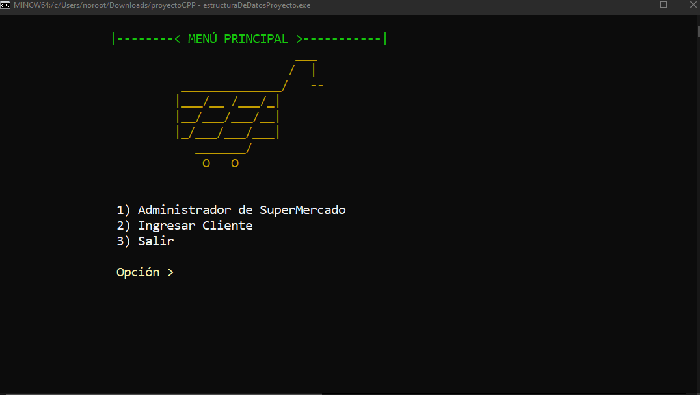
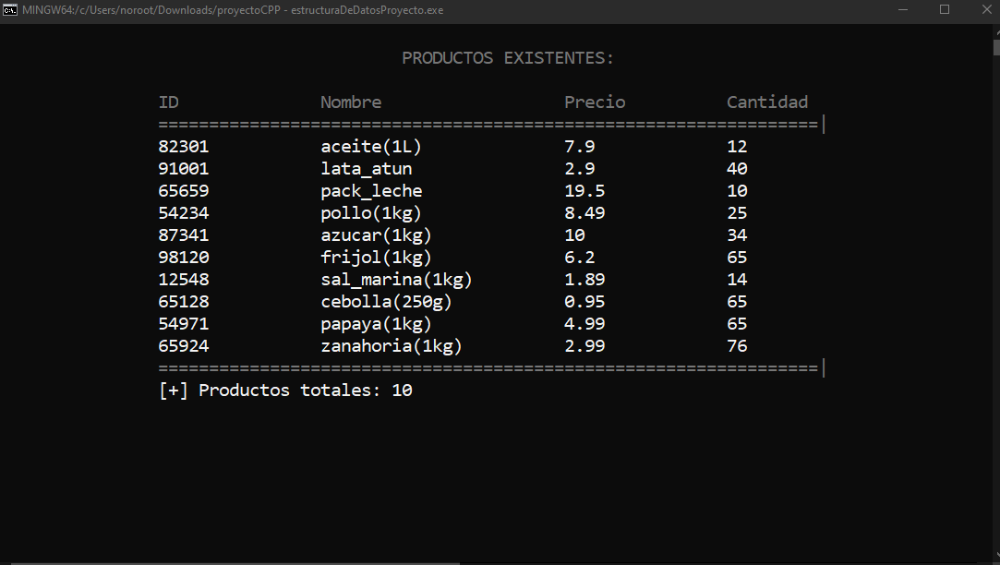

# Proyecto: Simulación de Tienda de Supermercado en C++

## Descripción
El proyecto consiste en simular una tienda de supermercado utilizando el lenguaje C++. El sistema contará con dos tipos de usuarios: un administrador y clientes.

### Funcionalidades del Administrador
El administrador podrá realizar las siguientes acciones:
- **Insertar producto**: Agregar nuevos productos al inventario.
- **Modificar producto**: Actualizar la información de productos existentes.
- **Eliminar producto**: Eliminar productos del inventario.
- **Mostrar los productos**: Visualizar el listado de productos disponibles.
- **Cargar productos de un almacén**: Leer y cargar productos desde archivos.

### Funcionalidades del Cliente
El cliente podrá realizar la acción de:
- **Comprar**: Adquirir productos de la tienda. Las compras realizadas se registrarán en un archivo de registro (escritura de archivos).

### Almacenamiento de Datos
- **Base de datos**: Los productos en el almacén se almacenarán en una base de datos relacional utilizando MySQL.

## Compilación del programa
**Windows**

```cmd
g++ -o estructuraDeDatosProyecto.exe estructuraDeDatosProyecto.cpp
```

**Linux**

```bash
sudo apt install g++
g++ -o estructuraDeDatosProyecto estructuraDeDatosProyecto.cpp
```

## Ejecución del programa




